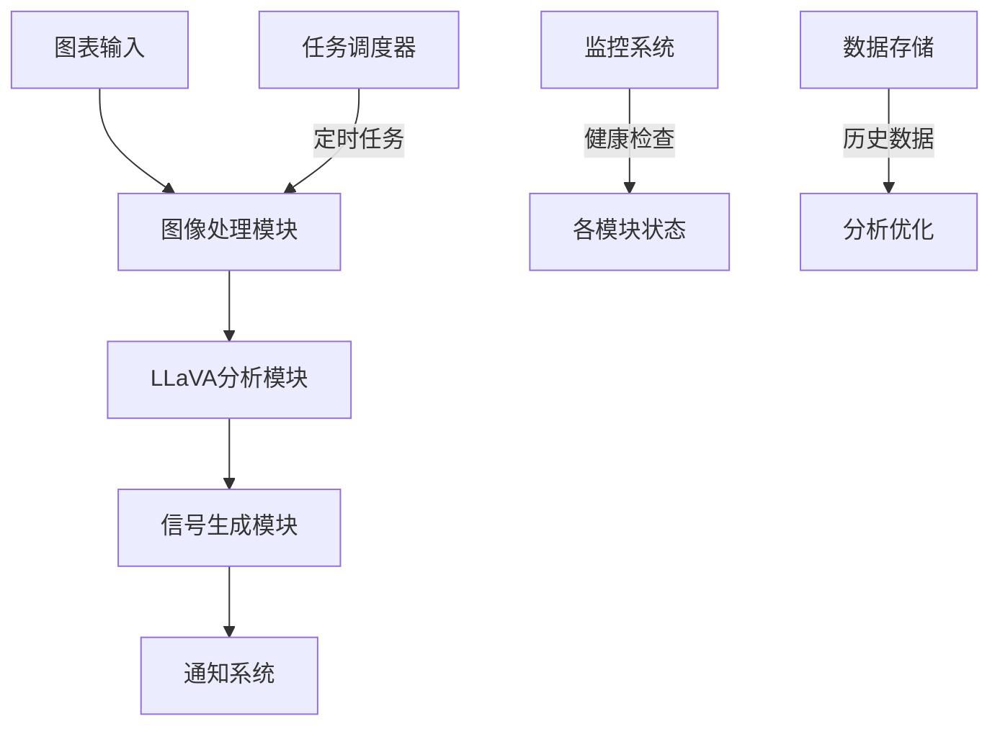

# SBS Trading Analysis System

基于 LLaVA 视觉语言模型的智能交易图表分析系统。本系统使用深度学习技术，结合计算机视觉和自然语言处理，实现自动化的交易图表分析和信号生成。

## 系统架构

### 1. 核心架构设计


### 2. 模块划分
- **图像处理模块**：负责图表预处理和质量控制
- **LLaVA分析模块**：核心AI分析引擎
- **信号生成模块**：交易信号生成和过滤
- **任务调度模块**：定时任务管理
- **监控系统**：性能和健康监控
- **通知系统**：多渠道信息分发
- **数据存储**：历史数据管理和分析

## 技术实现

### 1. 图像处理模块
- **图像质量检查**
  - 清晰度评估（Laplacian算子）
  - 对比度分析
  - 高频分量分析
  - 尺寸验证
- **预处理流程**
  - 图像缩放（标准化尺寸）
  - 对比度增强（CLAHE算法）
  - 降噪处理（Non-local Means）
  - 图像锐化（Unsharp Masking）
- **区域提取**
  - 边缘检测（Canny算法）
  - 轮廓识别
  - 智能裁剪
- **性能优化**
  - LRU缓存机制
  - 批处理支持
  - 内存管理

### 2. LLaVA分析模块
- **模型架构**
  - 基础模型：LLaVA 1.6 7B
  - LoRA微调适配
  - 多模态融合
- **分析能力**
  - 图表结构识别
  - 趋势分析
  - 形态识别
  - 价格水平预测
- **优化策略**
  - 动态批处理
  - 显存优化
  - 推理加速

### 3. 信号生成模块
- **信号类型**
  - 结构突破信号
  - SCE（Single Candle Entry）信号
  - 双顶/双底形态
  - 趋势确认信号
- **风险评估**
  - 多维度风险计算
  - 止损位确定
  - 盈利目标设定
- **信号过滤**
  - 可信度评估
  - 冲突检测
  - 时序验证

### 4. 任务调度模块
- **调度机制**
  - 基于APScheduler
  - 多任务并行处理
  - 失败重试机制
- **资源管理**
  - 内存监控
  - GPU资源分配
  - 任务队列管理
- **错误处理**
  - 异常捕获
  - 自动恢复
  - 日志记录

### 5. 监控系统
- **性能监控**
  - CPU/GPU使用率
  - 内存占用
  - 响应时间
  - 吞吐量
- **健康检查**
  - 服务状态监控
  - 依赖服务检查
  - 资源限制检查
- **告警机制**
  - 阈值告警
  - 错误通知
  - 性能降级提醒

## 部署架构

### 1. 容器化部署
- **Docker容器**
  - 应用容器
  - GPU支持容器
  - 监控容器
- **服务编排**
  - Docker Compose
  - 资源限制
  - 网络配置
- **持久化存储**
  - 数据卷挂载
  - 日志存储
  - 模型文件管理

### 2. 环境要求
- **硬件需求**
  - NVIDIA GPU (8GB+)
  - 系统内存 16GB+
  - 存储空间 50GB+
- **软件要求**
  - CUDA 11.8+
  - Docker 24.0+
  - NVIDIA Container Toolkit
- **网络要求**
  - 稳定的网络连接
  - 代理服务支持
  - API访问权限

## 开发工具链

### 1. 开发环境
- **IDE支持**
  - VSCode
  - PyCharm Professional
- **版本控制**
  - Git
  - GitHub Actions
- **代码质量**
  - Black
  - Flake8
  - MyPy

### 2. 测试框架
- **单元测试**
  - PyTest
  - Mock
- **集成测试**
  - Docker测试环境
  - 端到端测试
- **性能测试**
  - 压力测试
  - 负载测试

### 3. 监控工具
- **日志管理**
  - ELK Stack
  - Python-JSON-Logger
- **指标收集**
  - Prometheus
  - Grafana
- **性能分析**
  - cProfile
  - memory_profiler

## 使用指南

### 1. 安装部署
```bash
# 克隆代码库
git clone https://github.com/yourusername/sbs_system.git
cd sbs_system

# 创建配置文件
cp .env.example .env

# 编辑配置文件
vim .env

# 启动服务
docker-compose up -d
```

### 2. 配置说明
- **环境变量**
  - `DISCORD_TOKEN`: Discord Bot令牌
  - `WEBHOOK_URL`: 通知webhook地址
  - `MODEL_PATH`: 模型文件路径
  - `LOG_LEVEL`: 日志级别设置

### 3. 使用方法
1. 确保所有服务正常运行
2. 上传交易图表到指定频道
3. 系统自动进行分析
4. 通过配置的通道接收分析结果

### 4. 维护建议
- 定期检查日志文件
- 监控系统资源使用
- 更新依赖包版本
- 备份重要数据

## 开发路线图

### 1. 当前版本（v1.0）
- [x] 基础功能实现
- [x] Docker化部署
- [x] 监控系统集成
- [x] 文档完善

### 2. 下一版本（v2.0）
- [ ] 性能优化
- [ ] 新增市场支持
- [ ] API接口完善
- [ ] 自动化测试增强

### 3. 未来规划
- [ ] 分布式部署支持
- [ ] 实时数据处理
- [ ] 机器学习模型升级
- [ ] 更多分析指标

## 贡献指南

### 1. 提交规范
- 使用清晰的提交信息
- 遵循代码风格指南
- 包含必要的测试
- 更新相关文档

### 2. 开发流程
1. Fork 项目
2. 创建特性分支
3. 提交变更
4. 发起Pull Request

### 3. 文档维护
- 及时更新README
- 编写详细的注释
- 维护API文档
- 记录重要变更

## 许可证

本项目采用 MIT 许可证。详见 [LICENSE](LICENSE) 文件。

## 联系方式

- 项目维护者：[Your Name]
- 邮箱：[your.email@example.com]
- GitHub：[Your GitHub Profile]

## 致谢

感谢所有为本项目做出贡献的开发者。特别感谢：
- LLaVA团队提供的优秀模型
- OpenAI的GPT模型支持
- 所有项目贡献者

## 核心功能

### 1. Discord Bot 交互
- [x] 监听指定频道的图片上传
- [x] 自动处理和分析图表
- [x] 通过 Webhook 发送分析结果
- [x] 支持多通道消息分发

### 2. 图表分析
- [x] 使用 LLaVA 模型进行图表理解
- [x] SBS 序列识别和验证
- [x] 关键点位识别
- [x] 趋势和形态分析
- [x] 风险评估

### 3. 交易信号生成
- [x] 结构化信号输出
- [x] 多维度分析结果
- [x] 风险等级评估
- [x] 精确的价格水平识别

### 4. 自监督学习（非交易时段）
- [x] 历史数据自动分析
- [x] 模型自我优化
- [x] 性能指标跟踪
- [ ] 反馈循环优化

### 5. 系统监控
- [x] 健康状态检查
- [x] 性能指标收集
- [x] 资源使用监控
- [x] 错误追踪和报告

## SBS 分析逻辑

### 基本概念

1. **结构突破 (Structure Breakout)**
   - 向上突破：价格在创出前一个低点的高点后，被一根实体K线向上突破
   - 向下突破：价格创出前一个高点的低点后，被一根实体K线向下突破
   - 突破代表市场结构发生明显变化，是启动 SBS 序列的关键信号

2. **SBS 序列点位说明**
   - 点1：突破后的第一次回调形成的点（第一个明显的回调高点或低点）
   - 点2：由点1创造出的最高/最低点，作为主要盈利目标
   - 点3：在点1附近获取流动性的点（突破点1创造的高/低点）
   - 点4：在点3附近获取流动性或形成双底/双顶的确认点
   - 点5：趋势延续点，价格回到点2位置

### 关键形态识别

1. **双顶/双底形态**
   - 通常出现在点3和点4位置
   - 双底：下降趋势中形成两个接近的低点，预示反转为上涨
   - 双顶：上升趋势中形成两个接近的高点，预示反转为下跌
   - 确认：回调高点或低点被突破后确认

2. **流动性获取 (Liquidate)**
   - 定义：价格暂时突破关键支撑/阻力水平，触发止损订单
   - 特征：突破后无结构反转（实体K线未突破），价格迅速反转
   - 位置：通常发生在点4，作为最终入场确认

3. **单蜡烛入场 (SCE - Single Candle Entry)**
   - 一根蜡烛收盘后高点低点均高于/低于前一根不同颜色的蜡烛
   - 后续第一根蜡烛为同样颜色
   - 通常发生在点4位置
   - 表明市场已吸收足够流动性，当前结构得到确认

### 趋势分析工具

1. **移动平均线**
   - SMA20（浅灰色）：短期趋势
   - SMA200（深灰色）：长期趋势
   - 价格高于两条均线：上升趋势
   - 价格低于两条均线：下跌趋势

2. **Swing 结构**
   - Higher High (HH) 和 Higher Low (HL)：上升趋势
   - Lower Low (LL) 和 Lower High (LH)：下降趋势
   - 用于辅助判断市场波动的基本结构

### 交易规则

1. **入场条件**
   - 确认完整的1234点位序列
   - 点4出现以下任一确认信号：
     * 流动性获取
     * 双底/双顶形态
     * SCE入场信号

2. **止损设置**
   - 多头：点4下方
   - 空头：点4上方
   - 目的：防止假突破造成较大亏损

3. **止盈目标**
   - 主要目标：点2位置
   - 保守目标：点2至点3之间的61.8%斐波那契回撤位
   - 建议分批止盈，确保部分盈利

### 分析准则
1. 只在确认看到清晰的SBS序列时才生成信号
2. 对于不完整或不确定的形态，明确指出原因
3. 发现任何潜在风险时，在风险评估中详细说明
4. 所有价格水平精确到小数点后4位
5. 确保所有关键点位的时间顺序正确

## 开发计划

### 第一阶段（当前）
- [x] Discord Bot 基础功能
- [x] LLaVA 模型集成
- [x] 图表分析实现
- [x] Docker 环境搭建

### 第二阶段
- [ ] 自监督学习完善
- [ ] 模型性能优化
- [ ] 数据收集和存储
- [ ] 回测系统构建

### 第三阶段
- [ ] 自动交易集成
- [ ] 风险管理系统
- [ ] 多市场支持
- [ ] 性能报告系统

## 技术栈

### 核心组件
- Discord.py：Discord Bot 实现
- LLaVA：视觉语言模型
- PyTorch：深度学习框架
- FastAPI：健康检查服务

### 监控和日志
- Prometheus：指标收集
- Python-JSON-Logger：日志管理
- PSUtil：系统资源监控

### 数据处理
- Pandas：数据分析
- NumPy：数值计算
- OpenCV：图像处理

### 部署和运维
- Docker：容器化部署
- NVIDIA Container Toolkit：GPU 支持
- Docker Compose：服务编排

## 环境要求

### 硬件要求
- NVIDIA GPU（推荐 8GB+ 显存）
- 16GB+ 系统内存
- 50GB+ 存储空间

### 软件要求
- CUDA 11.8+
- Docker 24.0+
- NVIDIA Container Toolkit
- Clash Verge（代理服务）

## 目录结构

```
sbs_system/
├── config/                 # 配置文件
├── data/                  # 数据目录
│   └── historical_charts/ # 历史图表
├── logs/                  # 日志文件
├── models/                # 模型文件
│   └── llava-sbs/        # LLaVA 模型
├── screenshots/           # 图表截图
├── src/                   # 源代码
│   ├── bot/              # Discord Bot
│   ├── model/            # 分析模型
│   ├── notification/     # 通知系统
│   ├── training/         # 训练模块
│   └── utils/            # 工具函数
├── temp/                  # 临时文件
├── tests/                 # 测试代码
├── .env                   # 环境变量
├── docker-compose.yml     # Docker 配置
└── requirements.txt       # Python 依赖
```

## 使用说明

### 1. 环境准备
```bash
# 创建必要目录
mkdir -p models logs temp data/historical_charts screenshots

# 安装 NVIDIA Container Toolkit
distribution=$(. /etc/os-release;echo $ID$VERSION_ID)
curl -s -L https://nvidia.github.io/nvidia-docker/gpgkey | sudo apt-key add -
curl -s -L https://nvidia.github.io/nvidia-docker/$distribution/nvidia-docker.list | sudo tee /etc/apt/sources.list.d/nvidia-docker.list
sudo apt-get update && sudo apt-get install -y nvidia-container-toolkit
```

### 2. 配置设置
1. 复制 `.env.example` 到 `.env` 并填写配置
2. 确保 Discord Token 和 Webhook URLs 已正确设置
3. 检查代理配置（默认端口：7897）

### 3. 启动服务
```bash
# 构建镜像
docker-compose build

# 启动服务
docker-compose up -d

# 查看日志
docker-compose logs -f
```

### 4. 验证运行
1. 检查健康状态：`curl http://localhost:8080/health`
2. 查看 Discord Bot 在线状态
3. 测试图片上传和分析功能

## 注意事项

1. **模型文件**
   - 确保 LLaVA 模型文件完整
   - 检查模型权限设置
   - 定期更新模型版本

2. **网络配置**
   - 确保代理服务正常运行
   - 检查 Discord API 连接
   - 监控 Webhook 状态

3. **资源管理**
   - 监控 GPU 显存使用
   - 检查磁盘空间
   - 注意日志文件大小

4. **安全性**
   - 保护 Discord Token
   - 定期更新依赖
   - 监控异常访问

## 贡献指南

1. Fork 项目
2. 创建功能分支
3. 提交更改
4. 发起 Pull Request

## 许可证

MIT License

## Docker 部署说明

### 系统资源配置

本系统经过优化，可以充分利用以下硬件资源：
- CPU：最大使用12核（80%）
- 内存：最大使用28GB（87.5%）
- GPU：使用11GB显存（NVIDIA）

### Docker 环境配置

1. **基础镜像**
   - CUDA 基础镜像：`nvidia/cuda:11.8.0-cudnn8-runtime-ubuntu22.04`
   - 多阶段构建优化镜像大小
   - 内置代理支持

2. **资源限制**
```yaml
deploy:
  resources:
    limits:
      cpus: '12.0'
      memory: 28G
    reservations:
      devices:
        - driver: nvidia
          count: 1
          capabilities: [gpu]
          device_ids: ['0']
          options:
            memory: 11G
```

3. **目录挂载**
   - 模型文件（只读）：`./models:/app/models:ro`
   - 日志文件：`./logs:/app/logs`
   - 临时文件：`./temp:/app/temp`
   - 数据目录：`./data:/app/data`
   - 截图目录：`./screenshots:/app/screenshots`
   - 配置文件（只读）：`./config:/app/config:ro`

4. **网络配置**
   - 使用桥接网络：`sbs-network`
   - 支持host.docker.internal
   - 内置代理配置

5. **健康检查**
   - 检查间隔：30秒
   - 超时时间：10秒
   - 重试次数：3次
   - 启动等待：30秒

### 快速部署

1. **环境检查**
```bash
# 检查NVIDIA驱动
nvidia-smi

# 检查Docker版本
docker --version

# 检查Docker Compose版本
docker-compose --version
```

2. **构建镜像**
```bash
# 使用代理构建（推荐）
docker-compose build --build-arg http_proxy=http://host.docker.internal:7897 --build-arg https_proxy=http://host.docker.internal:7897

# 不使用代理构建
docker-compose build
```

3. **启动服务**
```bash
# 后台启动
docker-compose up -d

# 查看日志
docker-compose logs -f
```

4. **服务管理**
```bash
# 停止服务
docker-compose down

# 重启服务
docker-compose restart

# 查看状态
docker-compose ps
```

### 性能优化

1. **内存优化**
   - 使用PyTorch half precision (FP16)
   - 启用CUDA内存缓存
   - 优化批处理大小

2. **CPU优化**
   - 多进程数据处理
   - 异步IO操作
   - 使用uvicorn工作进程

3. **存储优化**
   - 日志轮转（10MB/文件，保留3个文件）
   - 临时文件自动清理
   - 使用只读挂载保护关键文件

### 故障排除

1. **常见问题**
   - GPU不可用：检查NVIDIA驱动和容器运行时
   - 代理连接失败：验证host.docker.internal配置
   - 内存溢出：调整部署资源限制

2. **日志查看**
```bash
# 查看实时日志
docker-compose logs -f discord-bot

# 查看错误日志
docker-compose logs -f discord-bot | grep ERROR

# 查看健康检查日志
docker-compose logs -f discord-bot | grep HEALTH
```

3. **资源监控**
```bash
# 查看容器资源使用
docker stats sbs-discord-bot

# 查看GPU使用
nvidia-smi -l 1
```

